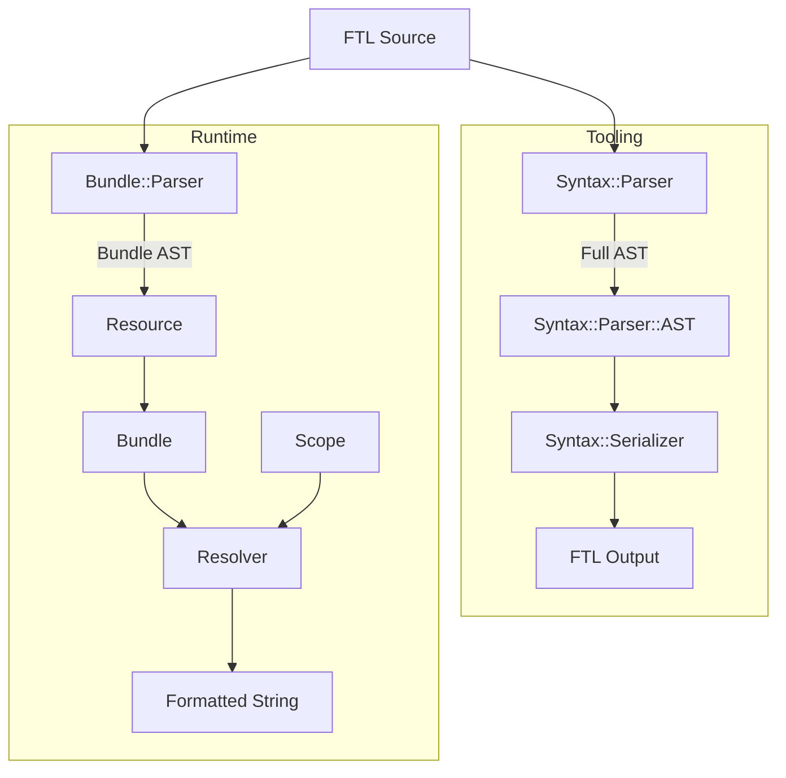
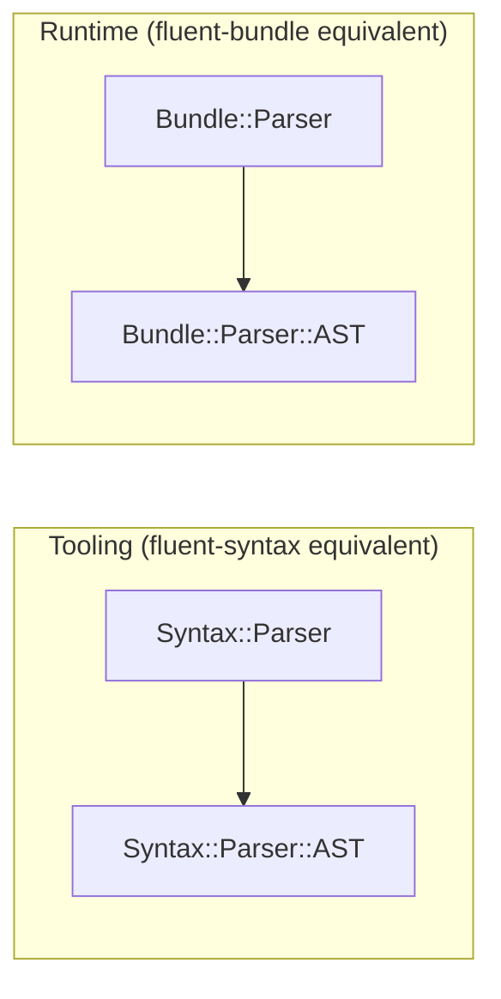

# Foxtail Architecture

## Overview

Foxtail is a Ruby implementation of [Project Fluent](https://projectfluent.org/), providing FTL parsing and runtime message formatting with `icu4x` integration.

## System Diagram



## Dual-Parser Architecture

Foxtail follows the fluent.js architecture with two separate parsers, each producing its own AST:



### Syntax Parser (`Syntax::Parser`) → `Syntax::Parser::AST`
- **Purpose**: Full-featured parser for tooling (linting, editing, serialization)
- **Output**: Complete AST with source positions (spans), comments, and detailed structure
- **Location**: `lib/foxtail/syntax/parser.rb`
- **AST**: Class-based nodes inheriting from `BaseNode`, comments and Junk preserved
- **Use Cases**: CLI tools (`lint`, `tidy`, `ids`), syntax analysis

### Bundle Parser (`Bundle::Parser`) → `Bundle::Parser::AST`
- **Purpose**: Lightweight runtime parser optimized for message formatting
- **Output**: Runtime AST directly usable by Bundle (no conversion needed)
- **Location**: `lib/foxtail/bundle/parser.rb`
- **AST**: Immutable `Data` classes, patterns simplified to String or Array, no spans
- **Use Cases**: Runtime message loading via `Resource`

## Core Components

### Syntax Layer

| Component | File | Responsibility |
|-----------|------|----------------|
| `Syntax::Parser` | `lib/foxtail/syntax/parser.rb` | FTL source → Full AST |
| `Syntax::Parser::Stream` | `lib/foxtail/syntax/parser/stream.rb` | Character-by-character reading |
| `Syntax::Parser::AST::*` | `lib/foxtail/syntax/parser/ast/` | 28 AST node classes |
| `Syntax::Serializer` | `lib/foxtail/syntax/serializer.rb` | AST → FTL source |

The syntax parser reads FTL source and produces a detailed AST with source position tracking (spans). Used by CLI tools.

### Resource Layer

| Component | File | Responsibility |
|-----------|------|----------------|
| `Resource` | `lib/foxtail/resource.rb` | Public parsing API for runtime |

`Resource` wraps `Bundle::Parser`, providing `from_string` and `from_file` methods.

### Bundle Layer

| Component | File | Responsibility |
|-----------|------|----------------|
| `Bundle` | `lib/foxtail/bundle.rb` | Message storage and formatting |
| `Bundle::Parser` | `lib/foxtail/bundle/parser.rb` | Runtime FTL parsing |
| `Bundle::Parser::AST` | `lib/foxtail/bundle/parser/ast.rb` | Runtime Data classes |
| `Resolver` | `lib/foxtail/bundle/resolver.rb` | Pattern evaluation |
| `Scope` | `lib/foxtail/bundle/scope.rb` | Variable context |

### Function Layer

| Component | File | Responsibility |
|-----------|------|----------------|
| `Function` | `lib/foxtail/function.rb` | NUMBER, DATETIME via `icu4x` |

## Data Flow

### Runtime Path (via Bundle::Parser)

```ruby
# 1. Parse FTL source directly to runtime AST
source = "hello = Hello, {$name}!"
resource = Foxtail::Resource.from_string(source)
# => Resource with Bundle::Parser::AST entries

# 2. Add to bundle
bundle = Foxtail::Bundle.new(ICU4X::Locale.parse("en"))
bundle.add_resource(resource)

# 3. Format message
result = bundle.format("hello", name: "World")
# => "Hello, World!"
```

### Tooling Path (via Syntax::Parser)

```ruby
# 1. Parse FTL source to full AST
source = "hello = Hello"
parser = Foxtail::Syntax::Parser.new
ast = parser.parse(source)
# => Syntax::Parser::AST::Resource

# 2. Analyze or modify AST
# ... linting, editing ...

# 3. Serialize back to FTL
serializer = Foxtail::Syntax::Serializer.new
output = serializer.serialize(ast)
# => "hello = Hello\n"
```

## Pattern Representation

Patterns are optimized during parsing:

| FTL Pattern | Bundle Representation |
|-------------|----------------------|
| `hello = Hello` | `"Hello"` (String) |
| `hello = Hello, {$name}!` | `["Hello, ", VariableReference, "!"]` (Array) |

## Expression Types

| Type | Example | Bundle Class |
|------|---------|--------------|
| Variable | `{$name}` | `VariableReference` |
| Message | `{greeting}` | `MessageReference` |
| Term | `{-brand}` | `TermReference` |
| Function | `{NUMBER($n)}` | `FunctionReference` |
| Select | `{$count -> ...}` | `SelectExpression` |
| String | `{"text"}` | `StringLiteral` |
| Number | `{123}` | `NumberLiteral` |

## Error Handling

- **Syntax parser errors**: Wrapped in `Junk` entries with `Annotation`
- **Bundle parser errors**: Invalid entries silently skipped (error recovery)
- **Runtime errors**: Optionally collected via `errors` array parameter, placeholders returned
- **Circular references**: Detected via `Scope.dirty` set

## `icu4x` Integration

Built-in functions use ICU4X for locale-aware formatting:

```ruby
# NUMBER function
NUMBER($amount, style: "currency", currency: "USD")

# DATETIME function
DATETIME($date, dateStyle: "medium")
```

## File Structure

```
lib/foxtail/
├── syntax/
│   ├── parser.rb              # Syntax::Parser (full AST)
│   ├── serializer.rb          # Syntax::Serializer
│   └── parser/
│       ├── stream.rb          # Syntax::Parser::Stream
│       └── ast/               # Syntax::Parser::AST (28 classes)
├── bundle/
│   ├── parser.rb              # Bundle::Parser (runtime)
│   ├── parser/
│   │   └── ast.rb             # Bundle::Parser::AST (Data classes)
│   ├── resolver.rb            # Resolver
│   └── scope.rb               # Scope
├── resource.rb                # Resource (public API)
├── bundle.rb                  # Bundle
└── function.rb                # NUMBER, DATETIME
```

## fluent.js Correspondence

| Foxtail | fluent.js | Purpose |
|---------|-----------|---------|
| `Foxtail::Syntax::Parser` | `@fluent/syntax` Parser | Full AST parsing |
| `Foxtail::Syntax::Serializer` | `@fluent/syntax` serialize | AST to FTL |
| `Foxtail::Bundle::Parser` | `@fluent/bundle` FluentResource | Runtime parsing |
| `Foxtail::Bundle` | `@fluent/bundle` FluentBundle | Message formatting |
