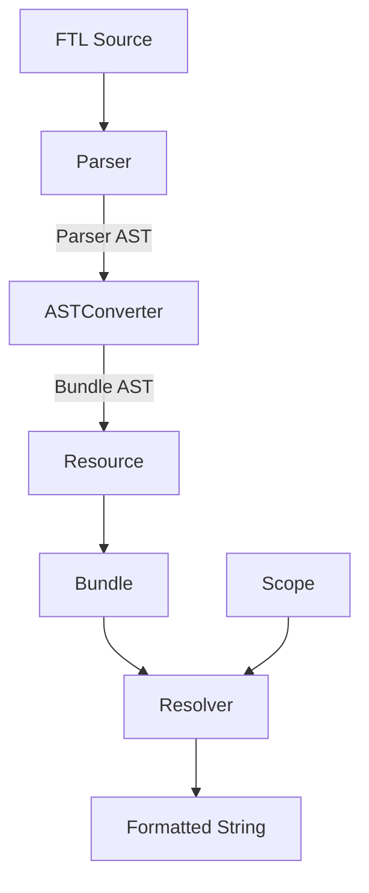
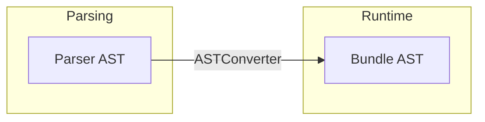

# Foxtail Architecture

## Overview

Foxtail is a Ruby implementation of [Project Fluent](https://projectfluent.org/), providing FTL parsing and runtime message formatting with `icu4x` integration.

## System Diagram



## Core Components

### Parser Layer

| Component | File | Responsibility |
|-----------|------|----------------|
| `Parser` | `lib/foxtail/parser.rb` | FTL source → Parser AST |
| `Stream` | `lib/foxtail/parser/stream.rb` | Character-by-character reading |
| `Parser::AST::*` | `lib/foxtail/parser/ast/` | 28 AST node classes |

The parser reads FTL source and produces a detailed AST with source position tracking (spans).

### Resource Layer

| Component | File | Responsibility |
|-----------|------|----------------|
| `Resource` | `lib/foxtail/resource.rb` | Public parsing API |
| `ASTConverter` | `lib/foxtail/bundle/ast_converter.rb` | Parser AST → Bundle AST |

`Resource` wraps the parser and converter, providing `from_string` and `from_file` methods.

### Bundle Layer

| Component | File | Responsibility |
|-----------|------|----------------|
| `Bundle` | `lib/foxtail/bundle.rb` | Message storage and formatting |
| `Bundle::AST` | `lib/foxtail/bundle/ast.rb` | Runtime Data classes |
| `Resolver` | `lib/foxtail/bundle/resolver.rb` | Pattern evaluation |
| `Scope` | `lib/foxtail/bundle/scope.rb` | Variable context |

### Function Layer

| Component | File | Responsibility |
|-----------|------|----------------|
| `Function` | `lib/foxtail/function.rb` | NUMBER, DATETIME via `icu4x` |

## Two-AST Design

Foxtail uses two separate AST representations:



### Parser AST (`Parser::AST::*`)

- Detailed structure preserving all FTL syntax
- Source span tracking for error reporting
- Hash-based nodes inheriting from `BaseNode`
- Used during parsing phase only

### Bundle AST (`Bundle::AST::*`)

- Optimized for runtime evaluation
- Immutable `Data` classes
- Patterns simplified to String or Array
- No span information

## Data Flow

### 1. Parsing

```ruby
source = "hello = Hello, {$name}!"
parser = Foxtail::Parser.new
parser_ast = parser.parse(source)
# => Parser::AST::Resource
```

### 2. Conversion

```ruby
converter = Foxtail::Bundle::ASTConverter.new
entries = converter.convert_resource(parser_ast)
# => [Bundle::AST::Message, ...]
```

### 3. Storage

```ruby
bundle = Foxtail::Bundle.new(ICU4X::Locale.parse("en"))
bundle.add_resource(resource)
# Messages/Terms stored in bundle.messages / bundle.terms
```

### 4. Resolution

```ruby
result = bundle.format("hello", name: "World")
# => "Hello, World!"
```

## Pattern Representation

Patterns are optimized during conversion:

| FTL Pattern | Bundle Representation |
|-------------|----------------------|
| `hello = Hello` | `"Hello"` (String) |
| `hello = Hello, {$name}!` | `["Hello, ", VariableReference, "!"]` (Array) |

## Expression Types

| Type | Example | Bundle Class |
|------|---------|--------------|
| Variable | `{$name}` | `VariableReference` |
| Message | `{greeting}` | `MessageReference` |
| Term | `{-brand}` | `TermReference` |
| Function | `{NUMBER($n)}` | `FunctionReference` |
| Select | `{$count -> ...}` | `SelectExpression` |
| String | `{"text"}` | `StringLiteral` |
| Number | `{123}` | `NumberLiteral` |

## Error Handling

- **Parse errors**: Wrapped in `Junk` entries with `Annotation`
- **Runtime errors**: Collected in `Scope.errors`, placeholders returned
- **Circular references**: Detected via `Scope.dirty` set

## `icu4x` Integration

Built-in functions use ICU4X for locale-aware formatting:

```ruby
# NUMBER function
NUMBER($amount, style: "currency", currency: "USD")

# DATETIME function
DATETIME($date, dateStyle: "medium")
```

## File Structure

```
lib/foxtail/
├── parser.rb              # Parser
├── resource.rb            # Resource (public API)
├── bundle.rb              # Bundle
├── function.rb            # NUMBER, DATETIME
├── parser/
│   ├── stream.rb          # Stream
│   └── ast/               # Parser AST (28 classes)
└── bundle/
    ├── ast.rb             # Bundle AST (Data classes)
    ├── ast_converter.rb   # ASTConverter
    ├── resolver.rb        # Resolver
    └── scope.rb           # Scope
```
