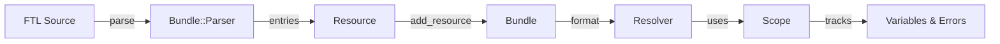
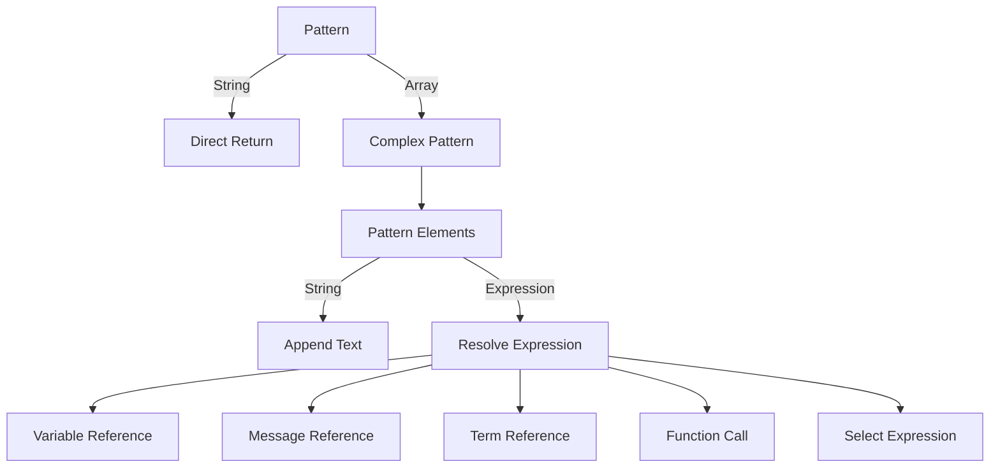

# Bundle System

## Overview

The Bundle system is the runtime component of Foxtail that stores messages and formats them with locale-aware processing. Bundle::Parser parses FTL source directly into a minimal runtime AST.

## Architecture



## Components

### Bundle

The main container for messages and terms.

```ruby
bundle = Foxtail::Bundle.new(ICU4X::Locale.parse("en-US"))
```

**Attributes**:

| Attribute | Type | Description |
|-----------|------|-------------|
| `locale` | `ICU4X::Locale` | Locale for formatting |
| `messages` | `Hash` | Message storage (id → Message) |
| `terms` | `Hash` | Term storage (id → Term) |
| `functions` | `Hash` | Custom functions |
| `use_isolating` | `Boolean` | Enable bidi isolation (default: true) |
| `transform` | `Proc` | Text transformation function - [not yet implemented](https://github.com/sakuro/foxtail/issues/118) |

**Key Methods**:

```ruby
# Add messages from a resource
bundle.add_resource(resource)

# Check for message existence
bundle.message?("hello") # => true

# Get message object
bundle.message("hello") # => Bundle::Parser::AST::Message

# Format a message
bundle.format("hello", name: "World") # => "Hello, World!"

# Format a pattern directly
bundle.format_pattern(pattern, name: "World")
```

### Resource

Wrapper for parsed FTL content, providing the bridge between parsing and runtime.
Uses `Bundle::Parser` internally for efficient runtime parsing with error recovery.

```ruby
# From string
resource = Foxtail::Resource.from_string(<<~FTL)
  hello = Hello, {$name}!
FTL

# From file
resource = Foxtail::Resource.from_file(Pathname("messages.ftl"))

# Access entries
resource.entries # => [Bundle::Parser::AST::Message, ...]

# Invalid entries are silently skipped (error recovery)
```

### Resolver

Evaluates patterns and expressions at runtime.

**Resolution Flow**:



### Scope

Manages variable context and error tracking during resolution.

**Attributes**:

| Attribute | Purpose |
|-----------|---------|
| `bundle` | Parent bundle reference |
| `args` | External variables |
| `locals` | Local variables (term arguments) |
| `errors` | Collected errors |
| `dirty` | Circular reference detection |

**Circular Reference Detection**:

```ruby
# Scope tracks active references to detect cycles
scope.track(reference) do
  # If reference already tracked, returns placeholder
  # Otherwise, resolves normally
end
```

## Bundle AST

The runtime uses optimized Data classes for immutability and performance.

### Entry Types

| Class | Purpose |
|-------|---------|
| `Message` | Message with id, value, and attributes |
| `Term` | Term (id starts with `-`) |

Note: Bundle AST does not include Junk or Comment entries (those are only in Syntax AST).
Invalid entries are skipped by the runtime parser's error recovery mechanism.

### Expression Types

| Class | FTL Syntax | Example |
|-------|------------|---------|
| `StringLiteral` | `{"text"}` | Quoted string |
| `NumberLiteral` | `{ 42 }` | Number with precision |
| `VariableReference` | `{$name}` | External variable |
| `MessageReference` | `{message}` | Message reference |
| `TermReference` | `{-term}` | Term reference |
| `FunctionReference` | `{NUMBER($n)}` | Function call |
| `SelectExpression` | `{$x -> ...}` | Pattern selection |

### Pattern Optimization

Patterns are optimized during AST conversion:

| FTL Pattern | Runtime Representation |
|-------------|----------------------|
| `hello = Hello` | `"Hello"` (String) |
| `hello = {$name}` | `VariableReference` (single element) |
| `hello = Hi, {$name}!` | `["Hi, ", VariableReference, "!"]` (Array) |

## Usage Examples

### Basic Formatting

```ruby
bundle = Foxtail::Bundle.new(ICU4X::Locale.parse("en-US"))
resource = Foxtail::Resource.from_string(<<~FTL)
  hello = Hello, {$name}!
FTL

bundle.add_resource(resource)
bundle.format("hello", name: "World")
# => "Hello, World!"
```

### Pluralization

```ruby
resource = Foxtail::Resource.from_string(<<~FTL)
  emails = { $count ->
      [0] No emails
      [one] One email
     *[other] {$count} emails
  }
FTL

bundle.add_resource(resource)
bundle.format("emails", count: 0)   # => "No emails"
bundle.format("emails", count: 1)   # => "One email"
bundle.format("emails", count: 5)   # => "5 emails"
```

### Terms for Reusable Content

```ruby
resource = Foxtail::Resource.from_string(<<~FTL)
  -brand = Foxtail
  about = About {-brand}
  powered-by = Powered by {-brand}
FTL

bundle.add_resource(resource)
bundle.format("about")       # => "About Foxtail"
bundle.format("powered-by")  # => "Powered by Foxtail"
```

### Attributes

```ruby
resource = Foxtail::Resource.from_string(<<~FTL)
  login = Log In
      .placeholder = Username
      .aria-label = Login button
FTL

bundle.add_resource(resource)
message = bundle.message("login")
# Access attributes via message.attributes["placeholder"]
```

### Multiple Resources

```ruby
# Resources can be added incrementally
bundle.add_resource(common_resource)
bundle.add_resource(page_specific_resource)

# Control overrides
bundle.add_resource(overrides, allow_overrides: true)
```

## Error Handling

### Parse Errors

The runtime parser (`Bundle::Parser`) uses error recovery - invalid entries are silently skipped.
This provides robust runtime behavior where malformed FTL doesn't break the application.

```ruby
# Invalid entries are silently skipped
resource = Foxtail::Resource.from_string(<<~FTL)
  valid = This works
  invalid entry without equals
  also_valid = This also works
FTL

resource.entries.map(&:id) # => ["valid", "also_valid"]
```

For detailed error reporting during development, use `Syntax::Parser` instead.

### Runtime Errors

Runtime errors can be collected by passing an array as the second argument:

```ruby
# Without error collection - errors result in placeholder text
result = bundle.format("hello", name: "World")
# Missing variables show as: {$variable_name}

# With error collection
errors = []
result = bundle.format("hello", errors, name: "World")
# errors now contains any resolution errors
errors.each {|e| puts e } # => "Unknown variable: $missing"
```

This follows the fluent.js pattern where passing an errors array collects errors instead of ignoring them.

### Error Recovery

The system gracefully handles:

| Error | Behavior |
|-------|----------|
| Missing message | Returns message ID |
| Missing variable | Returns `{$name}` placeholder |
| Missing term | Returns `{-name}` placeholder |
| Unknown function | Returns `{FUNCTION()}` placeholder |
| Circular reference | Returns placeholder, prevents infinite loop |

## Configuration Options

### Use Isolating

Controls bidirectional text isolation:

```ruby
bundle = Foxtail::Bundle.new(locale, use_isolating: true) # default
# Wraps placeables with Unicode isolation marks (FSI U+2068, PDI U+2069)
```

When enabled (default), placeables are wrapped with Unicode bidi isolation marks to prevent text direction issues when mixing RTL and LTR content. The marks are invisible in normal text display.

**Tip**: When writing tests that compare formatted output strings, you may want to use `use_isolating: false` to avoid invisible Unicode characters in assertions:

```ruby
let(:bundle) { Foxtail::Bundle.new(locale, use_isolating: false) }
```

### Transform

Apply text transformations ([not yet implemented](https://github.com/sakuro/foxtail/issues/118)):

```ruby
bundle = Foxtail::Bundle.new(locale, transform: ->(s) { s.upcase })
bundle.format("hello", name: "world")
# => "HELLO, WORLD!"
```

### Custom Functions

Register custom formatting functions:

```ruby
bundle = Foxtail::Bundle.new(locale, functions: {
  "SHOUT" => ->(args, _opts, _scope) { args.first.to_s.upcase }
})

# FTL: greeting = {SHOUT($name)}
bundle.format("greeting", name: "hello") # => "HELLO"
```

## Integration with ICU4X

The Bundle uses `icu4x` for:

- Locale handling (`ICU4X::Locale`)
- Number formatting (`NUMBER` function)
- Date/time formatting (`DATETIME` function)
- Plural rules for variant selection

See [icu4x-integration.md](icu4x-integration.md) for details.
