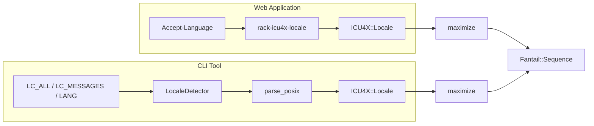

# Language Negotiation and Locale Fallback

This document describes how language negotiation and locale fallback should work when using Fantail with web applications.

## Overview

There are three layers of locale handling:

| Layer | Responsibility | Component |
|-------|---------------|-----------|
| **Request** | Determine user's preferred locale from Accept-Language | `rack-icu4x-locale` |
| **Message** | Find translation messages with fallback | `Fantail::Sequence` |
| **Formatting** | Format numbers/dates with CLDR data | `ICU4X::DataProvider` |

## Critical Rule: Script Boundaries

**Never cross script boundaries in fallback.** This avoids politically and culturally sensitive issues:

```ruby
# NEVER fallback across these (different writing systems)
zh-TW (Hant) → zh-CN (Hans)  # Taiwan → PRC - politically sensitive
sr-Latn → sr-Cyrl            # Latin Serbian → Cyrillic Serbian

# OK to fallback (same script, different region)
en-AU → en-US  # Both Latin script
ja-JP → ja     # Both Japanese script
zh-HK → zh-TW  # Both Traditional Chinese (Hant)
```

## Recommended Architecture

### 1. Language Negotiation (rack-icu4x-locale)

The `rack-icu4x-locale` gem handles Accept-Language negotiation:

```ruby
# config.ru or application.rb
use Rack::ICU4X::Locale,
  locales: %w[en ja zh-CN zh-TW],
  detectors: [
    :header # Accept-Language
  ],
  default: "en"
```

Key behaviors:
- Uses `ICU4X::Locale#maximize` to expand locales (e.g., `zh-TW` → `zh-Hant-TW`)
- Matches only when scripts are compatible
- Falls back to `default` when no match found

### 2. Bundle Selection

Build a `Fantail::Sequence` from the negotiated locales:

```ruby
class LocaleHelper
  def initialize(bundles)
    @bundles = bundles  # Hash: locale_string => Fantail::Bundle
  end

  def sequence_for(env)
    locales = env["rack.icu4x.locale"]

    # Build sequence from matched locales
    bundles = locales.filter_map { |locale| @bundles[locale.to_s] }

    # Always include default fallback
    bundles << @bundles["en"] unless bundles.any?

    Fantail::Sequence.new(bundles)
  end
end
```

### 3. Message Formatting

Use the sequence to format messages:

```ruby
sequence = locale_helper.sequence_for(env)
message = sequence.format("hello-user", name: user.name)
```

## Fallback Examples

### Example 1: Exact Match Available

```
User: Accept-Language: ja-JP
Available: [ja, en]
Negotiation: ja-JP matches ja (same language, ja → ja-Jpan-JP)
Sequence: [ja_bundle, en_bundle]
Result: Japanese messages shown
```

### Example 2: Script Mismatch - Safe Fallback

```
User: Accept-Language: zh-TW
Available: [zh-CN, en]
Negotiation: zh-TW (Hant) ≠ zh-CN (Hans) - script mismatch!
Sequence: [en_bundle]  # Fallback to English, NOT Chinese
Result: English messages shown (safe fallback)
```

### Example 3: Script Match - Regional Fallback

```
User: Accept-Language: zh-HK
Available: [zh-TW, en]
Negotiation: zh-HK (Hant) matches zh-TW (Hant) - same script
Sequence: [zh_tw_bundle, en_bundle]
Result: Traditional Chinese (Taiwan) messages shown
```

### Example 4: Serbian Script Variants

```
User: Accept-Language: sr-Latn
Available: [sr-Cyrl, en]
Negotiation: sr-Latn ≠ sr-Cyrl - script mismatch!
Sequence: [en_bundle]
Result: English messages shown (safe fallback)
```

## UX Considerations

When the user's preferred language is not available, consider notifying them:

```ruby
def check_locale_availability(env)
  requested = env["HTTP_ACCEPT_LANGUAGE"]
  matched = env["rack.icu4x.locale"]

  if matched.empty? && requested.present?
    # User requested a language we don't support
    flash[:locale_notice] = "Your preferred language is not available. Showing English."
  end
end
```

## Sequence Behavior

`Fantail::Sequence` is intentionally simple:

1. Takes an ordered list of bundles
2. For each message request, returns the first bundle that has it
3. **Does not** automatically add fallback bundles
4. **Does not** understand locale relationships

This design puts the application developer in control of fallback behavior.

## CLI Tools

For command-line tools, use POSIX locale environment variables instead of Accept-Language:

### Environment Variable Priority

```
LC_ALL > LC_MESSAGES > LANG
```

### Locale Detection

```ruby
module Fantail
  module CLI
    class LocaleDetector
      LOCALE_VARS = %w[LC_ALL LC_MESSAGES LANG].freeze

      def detect
        posix_locale = LOCALE_VARS.lazy.filter_map { |var| ENV[var] }.first || "C"
        ICU4X::Locale.parse_posix(posix_locale).maximize
      end
    end
  end
end
```

### Usage

```ruby
detector = Fantail::CLI::LocaleDetector.new
locale = detector.detect  # => ICU4X::Locale (maximized)

# Build sequence based on detected locale
bundle = load_bundle_for(locale)
sequence = Fantail::Sequence.new([bundle, fallback_bundle])
```

### POSIX to BCP 47 Conversion

The `ICU4X::Locale.parse_posix` method handles conversion:

```ruby
ICU4X::Locale.parse_posix("ja_JP.UTF-8")    # => ja-JP
ICU4X::Locale.parse_posix("sr_RS@latin")    # => sr-Latn-RS
ICU4X::Locale.parse_posix("zh_TW.UTF-8")    # => zh-TW (→ zh-Hant-TW after maximize)
ICU4X::Locale.parse_posix("C")              # => und
ICU4X::Locale.parse_posix("POSIX")          # => und
```

## Architecture Summary



Both paths apply the same script-safety rules via `maximize`.

## Related Components

- **rack-icu4x-locale**: Language negotiation middleware ([GitHub](https://github.com/sakuro/rack-icu4x-locale))
- **icu4x gem**: `Locale#maximize`/`#minimize` for locale expansion
- **Fantail::Sequence**: Message fallback across bundles

## References

- [UTS #35: Likely Subtags](https://unicode.org/reports/tr35/#Likely_Subtags)
- [BCP 47: Language Tags](https://www.rfc-editor.org/info/bcp47)
- [@fluent/langneg](https://github.com/projectfluent/fluent.js/tree/main/fluent-langneg) - JavaScript reference implementation
