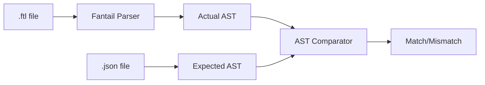

# Testing Strategy

## Overview

Fantail uses RSpec for testing with a focus on:

1. Unit tests for individual components
2. Compatibility tests against fluent.js reference implementation
3. Integration tests for the full formatting pipeline

## Test Structure

```
spec/
├── spec_helper.rb                    # RSpec configuration
├── compat/
│   ├── syntax_parser_spec.rb         # fluent-syntax compatibility tests
│   └── bundle_parser_spec.rb         # fluent-bundle compatibility tests
├── fantail/
│   ├── syntax/
│   │   └── parser_spec.rb            # Syntax::Parser tests
│   └── bundle/
│       ├── parser_spec.rb            # Bundle::Parser tests
│       ├── resolver_spec.rb          # Resolver tests
│       └── scope_spec.rb             # Scope tests
└── support/
    └── compat/
        ├── base.rb                   # Shared utilities
        ├── syntax.rb                 # fluent-syntax support
        ├── syntax/
        │   ├── ast_comparator.rb     # AST comparison logic
        │   └── matchers.rb           # Custom RSpec matchers
        ├── bundle.rb                 # fluent-bundle support
        └── bundle/
            └── ast_converter.rb      # AST conversion logic
```

## Running Tests

### All Tests

```bash
bundle exec rake spec
# or
bundle exec rspec
```

### Specific Files

```bash
bundle exec rspec spec/fantail/parser_spec.rb
bundle exec rspec spec/fantail/bundle/resolver_spec.rb
```

### Specific Examples

```bash
bundle exec rspec spec/fantail/parser_spec.rb:42
```

### With Documentation Output

```bash
bundle exec rspec --format documentation
```

## Compatibility Testing

### fluent.js Test Fixtures

Fantail uses test fixtures from the fluent.js project (in `fluent.js/` submodule) to ensure parsing compatibility.

**Fixture Types**:

| Category | Description | Spans |
|----------|-------------|-------|
| `structure` | Syntax structure tests | With spans |
| `reference` | Reference parsing tests | Without spans |

**Current Status**: 159/160 fixtures passing (99.4%)

### Running Compatibility Tests

```bash
bundle exec rspec spec/compat/
```

### Compatibility Test Architecture



### Known Mismatches

One fixture (`leading_dots`) is marked as pending. This test also fails in fluent.js itself.

```ruby
# spec/support/compat/syntax.rb
KNOWN_MISMATCHES = [
  {category: :reference, name: "leading_dots"}
].freeze
```

## Unit Test Patterns

### Parser Tests

```ruby
RSpec.describe Fantail::Syntax::Parser do
  let(:parser) { Fantail::Syntax::Parser.new }

  describe "#parse" do
    it "parses simple message" do
      result = parser.parse("hello = Hello")
      expect(result.body.size).to eq(1)
      expect(result.body.first).to be_a(Fantail::Syntax::Parser::AST::Message)
    end
  end
end
```

### Bundle Tests

```ruby
RSpec.describe Fantail::Bundle do
  let(:locale) { ICU4X::Locale.parse("en-US") }
  let(:bundle) { Fantail::Bundle.new(locale) }

  describe "#format" do
    before do
      resource = Fantail::Resource.from_string("hello = Hello, {$name}!")
      bundle.add_resource(resource)
    end

    it "formats message with variables" do
      expect(bundle.format("hello", name: "World")).to eq("Hello, World!")
    end
  end
end
```

### Resolver Tests

```ruby
RSpec.describe Fantail::Bundle::Resolver do
  let(:locale) { ICU4X::Locale.parse("en-US") }
  let(:bundle) { Fantail::Bundle.new(locale) }
  let(:resolver) { Fantail::Bundle::Resolver.new(bundle) }

  describe "#resolve_pattern" do
    it "resolves simple string pattern" do
      scope = Fantail::Bundle::Scope.new(bundle)
      expect(resolver.resolve_pattern("Hello", scope)).to eq("Hello")
    end
  end
end
```

## Test Helpers

### FluentCompatSyntax

```ruby
include FluentCompatSyntax

# Get all fixtures
FluentCompatSyntax.all_fixtures

# Parse FTL source
ast = parse_ftl(source, with_spans: true)

# Process junk annotations
process_junk_annotations!(ast)

# Check for known mismatches
known_mismatch?(fixture)

# Load fixture files
expected_ast = load_json(json_path)
ftl_source = load_ftl(ftl_path)
```

### FluentCompatBundle

```ruby
include FluentCompatBundle

# Get all fixtures
FluentCompatBundle.all_fixtures

# Parse FTL source
entries = parse_ftl(source)

# Convert to JSON format
json = convert_to_json(entries)
```

### Custom Matchers

```ruby
# AST matching (fluent-syntax only)
expect(actual_ast).to match_ast(expected_ast)
```

## Code Quality

### RuboCop

```bash
bundle exec rubocop        # Check style
bundle exec rubocop -a     # Auto-fix
```

### Full Check

```bash
bundle exec rake           # Runs spec + rubocop
```

## Coverage

SimpleCov is configured in `spec_helper.rb` for test coverage reporting.

```ruby
# spec/spec_helper.rb
require "simplecov"
```

Coverage reports are generated in `coverage/` directory.

## CI Integration

Tests run automatically on GitHub Actions:

- On push to main branch
- On all pull requests

## Writing New Tests

### Guidelines

1. **Use RSpec expect syntax**: `expect(x).to eq(y)`
2. **Disable monkey patching**: Tests use `disable_monkey_patching!`
3. **Avoid `described_class`**: Reference classes explicitly
4. **Use let for setup**: Prefer `let` over instance variables

### Example Test File

```ruby
# frozen_string_literal: true

RSpec.describe Fantail::SomeClass do
  let(:instance) { Fantail::SomeClass.new }

  describe "#method_name" do
    context "when condition" do
      it "does something" do
        expect(instance.method_name).to eq(expected_value)
      end
    end

    context "when other condition" do
      it "does something else" do
        expect(instance.method_name).to eq(other_value)
      end
    end
  end
end
```

## Debugging Tests

### Verbose Output

```bash
bundle exec rspec --format documentation
```

### Focus on Specific Tests

```ruby
# Temporarily add :focus tag
it "important test", :focus do
  # ...
end
```

```bash
bundle exec rspec --tag focus
```

### Print Debugging

```ruby
it "test with debugging" do
  result = some_method
  pp result # Pretty print
  expect(result).to eq(expected)
end
```
